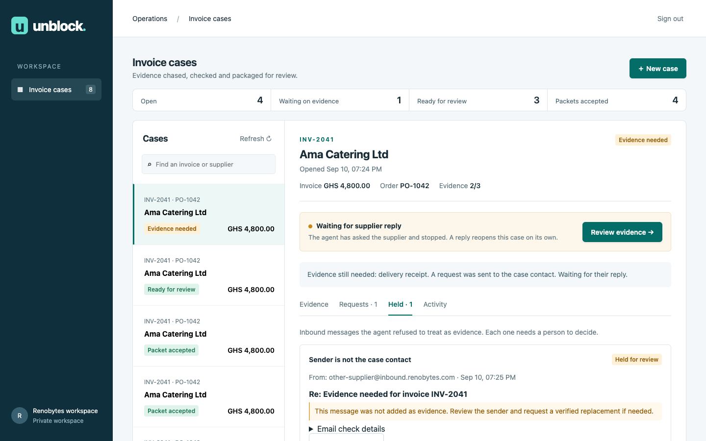

# Unblock

An invoice evidence workspace built with **Strands Agents SDK** and Amazon Bedrock. It compares supplier documents to an invoice case, explains missing or inconsistent evidence, emails the supplier for what is missing, and resumes on its own when the reply arrives.

**Release status: development/pilot foundation, not an audited production service.** No payment is authorized. Outbound mail is disabled unless a deployment explicitly enables it and supplies a recipient allowlist.



This screenshot is from a real AWS/SES test using synthetic documents and project-controlled addresses. It is separate from the simulated public sample.

[Download the three-minute live demo](https://github.com/Ra-is/unblock/releases/download/v0.1.0/unblock-demo.mp4) · [Captions](https://github.com/Ra-is/unblock/releases/download/v0.1.0/unblock-demo.vtt) · [Release notes](https://github.com/Ra-is/unblock/releases/tag/v0.1.0)

## What works

- Cognito sign-in (authorization code + PKCE), organization-scoped records, reviewer permissions.
- Invoice cases with exact amounts in integer minor units; idempotent creation.
- Private S3 uploads (PDF, TXT, PNG, JPEG; 4 MB maximum), content deduplication, authenticated downloads.
- A Strands coordinator calls case-scoped tools and a structured document extraction specialist on Bedrock.
- Application rules check supplier, order, invoice reference, amount, currency, and signed delivery confirmation. Unreadable or missing values fail closed.
- **The agent sends real evidence requests through SES** to the contact fixed on the case. It cannot choose a different recipient, and an allowlist plus a master switch bound who may ever be contacted.
- **Supplier replies arrive by email and restart the agent without anyone opening the browser.** Each case has an unguessable reply address; SES stores the message, a Lambda validates it, attaches the evidence and queues the next review.
- **Inbound mail that fails a check is held, not processed** — a failed spam or virus verdict, a sender who is not the case contact, a reply with no usable attachment, or a case already reviewed. A reviewer decides what happens next.
- DynamoDB transactions persist each change, its audit event, and any new job together.
- DynamoDB Streams dispatch to SQS FIFO. A Lambda worker resumes independently of the browser. Repeated jobs, requests and checks are idempotent.
- Wrong-document correction, JSON evidence packets, and version-checked human review.
- CloudFormation infrastructure, encrypted/versioned S3, DynamoDB point-in-time recovery, queue dead letters, bounded model invocations, and CloudWatch alarms.

## Try it without an account

The [deployed workspace](https://jmpsg8amf1.execute-api.eu-west-2.amazonaws.com) has an **Explore a sample case** button. It opens a clearly labeled **simulated sample walkthrough** with synthetic documents, a simulated request, a corrected receipt and a held message. These sample events are illustrative, not a recorded live agent run. No sign-up or shared credentials are needed.

The demo account is its own tenant, is never a reviewer, and every write endpoint refuses it at the
API — not just in the interface. It cannot open cases, upload evidence, run the agent, accept a
packet, or reach another tenant's data. Sample cases have no new reply-routing tokens; old exposed pointers are ignored before any inbox mutation. Worker and mail-service checks also prohibit sending or launching agent work for samples. API case views, audit responses and exports remove nested reply addresses and tokens for all users.

## Local development

```sh
uv sync --frozen
AWS_PROFILE=renobytes AWS_DEFAULT_REGION=eu-west-2 uv run uvicorn unblock.api:app --host 127.0.0.1 --port 8000 --reload
```

Open http://127.0.0.1:8000. Without AWS resource configuration, the local API has a development identity and in-memory case storage; files are in `.local/documents`. **Local cases disappear on process restart.** Real model calls use the selected AWS profile and incur Bedrock charges. There is no hidden mock agent. Never bind local authentication mode to a public interface.

## Tests

```sh
uv run pytest -q
uv run ruff check unblock scripts tests
uv run cfn-lint infra/*.yaml
node --check unblock/web/app.js
```

Tests cover business invariants, tenant boundaries, reviewer authorization, invalid uploads, optimistic concurrency, DynamoDB transactions, idempotency, reply-address routing, sender and verdict checks, and the quarantine path.

Two scripts exercise the deployed system rather than mocks. `scripts/smoke.py` covers upload, Strands/Bedrock extraction, correction and human review. `scripts/smoke_mail.py` covers the loop that makes this an agent: it sends a real request through SES, confirms the case stops and waits, replies once from an address that is not the case contact (which must be held with no evidence attached), then replies from the real contact and confirms the agent resumed and satisfied the requirement without a browser open.

## AWS deployment

```sh
uv run python scripts/deploy.py --profile renobytes --region eu-west-2 \
  --inbound-domain inbound.renobytes.com \
  --mail-from unblock@renobytes.com \
  --allowed-recipients you@example.com \
  --hosted-zone-id ZXXXXXXXXXXXXX \
  --enable-sending
uv run python scripts/create_owner.py
uv run python scripts/create_demo.py   # optional: read-only guest workspace
uv run python scripts/deploy.py ...    # again, so the API picks up the demo credentials
uv run python scripts/smoke.py
uv run python scripts/smoke_mail.py
```

For a new deployment, omitting the mail flags leaves email disabled. Updates preserve existing mail settings unless flags explicitly change them; `--no-enable-sending` disables sending. `--enable-sending` requires a sender and an allowlist. The template manages MX and a DMARC policy only for the project's inbound subdomain; it does not change apex-domain mail routing or policy. CloudFormation creates the SES receipt rule set and the script activates it.

The deployment script packages locked Linux/Python 3.12 dependencies and deploys `unblock-dev-artifacts` and `unblock-dev`. Resources are tagged `Project=Unblock`. It writes resource outputs to `.local/deployment.json`. Owner credentials are generated locally into `.local/owner-access.json` with owner-only permissions; they are never committed or printed. Sign in through the deployed application's button using those credentials.

The deployment uses the profile only from your machine. Lambda uses separate IAM execution roles. Your AWS keys are never bundled into the application. The API cannot invoke models; the worker cannot upload documents. All business endpoints authenticate on the server. Document routes derive tenant access from the verified identity, never a request's tenant field.

Before provisioning additional users, explicitly assign their immutable `custom:tenant` attribute with an administrator. Add only authorized reviewers to the `reviewer` group. Self-registration is disabled. This release has one bootstrap owner; organization invitations and user-management screens are not implemented.

## Try the correction workflow

Create a case for `Ama Catering Ltd`, invoice `INV-2041`, order `PO-1042`, total `GHS 4800.00`. Set the contact address to a mailbox you control and that appears in the deployment's allowlist.

1. Upload `examples/invoice.txt`, `purchase-order.txt`, and `wrong-receipt.txt`.
2. Select **Review evidence**. The wrong-order receipt must remain unresolved.
3. The agent emails your contact address and the case moves to **Waiting for supplier reply**. Nothing further happens in the browser.
4. Reply to that email from the contact address with `examples/correct-receipt.txt` attached.
5. The case reopens on its own: the reply is validated, the requirement is satisfied, and the request is marked resolved.
6. Accept the packet as a reviewer and export its audit history.

To see the escalation path, reply from a different address instead. The message is held under **Held** with the reason `unexpected_sender`, no evidence is attached, and a reviewer must decide.

All example files are explicitly synthetic. Extracted signatures and fields are claims in a document, not identity or authenticity verification.

## Scope and next release

Read [architecture](docs/architecture.md) and [operations](docs/operations.md) for design boundaries and recovery.

Before a customer production launch: add scanned-PDF OCR and dedicated attachment malware scanning; handle bounces and complaints from an SES notification topic; introduce organization/user administration and MFA; establish retention/deletion and data-residency policies; perform prompt-injection evaluations, load tests and backup-restore drills; connect alarms to an operator; and perform an independent security review.

The current case checklist expects an invoice, a matching purchase order, and a signed delivery receipt. It does not support partial deliveries, multi-currency invoices, amended orders, tax reconciliation, or bank-account verification. The coordinator can email the case contact but cannot approve payment or reach anyone else. Cases are bounded to 30 documents, 40 requests and 40 held messages. The list currently shows up to 100 cases; cursor pagination is a next-release requirement.

Mail delivery is at least once. A request is recorded before it is sent, so a crash between the two can repeat a send. Inbound requires SES spam and virus PASS, DMARC PASS with at least one passing SPF/DKIM method, and exactly one From address matching the case contact. Missing, failed, GRAY and processing-error authentication verdicts are held. This conservative policy can hold legitimate mail from domains using monitoring-only DMARC policies; it never silently waives authentication. Domain authentication is not proof of an individual person's identity. See [AWS SES verdict definitions](https://docs.aws.amazon.com/ses/latest/dg/receiving-email-notifications-contents.html).

## Submission materials

See [the demo guide](docs/demo-guide.md) for the live recording flow and [the build story](docs/build-story.md) for a publication-ready technical narrative. The live test uses controlled mailboxes on the project's inbound subdomain, genuine SES transport and real Bedrock calls, with synthetic business documents. It does not contact unrelated people.

AgentCore deployment can be added when its managed runtime capabilities justify migration. This release uses Lambda/SQS for bounded event-driven execution; it does not claim AgentCore integration.

## License

MIT. See [LICENSE](LICENSE).
