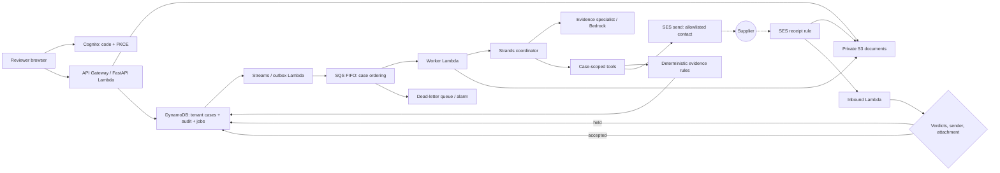

# Architecture and decisions

The dotted edges are the part that makes this an agent rather than a request handler: the coordinator stops after sending, the process ends, and an inbound message days later is what starts the next turn.

## Case state

`blocked → ready_for_review → reviewed`. Documents can be pending, accepted (field checks matched), or need correction. The LLM does not set case completion. `recompute` derives readiness from the accepted documents. A verified reviewer must then provide a note and the current case version. This accepts only the evidence packet.

## Agent boundary

The coordinator can inspect its assigned case, examine pending documents, and email the case contact. Its closures bind tenant and case IDs; the model cannot choose another tenant, arbitrary S3 keys, arbitrary recipients, or arbitrary code. Document extraction receives untrusted source content with a Pydantic output schema. Programmatic checks enforce exact money, currency and reference matches. The model's narrative has no authority over business state.

The recipient is never a tool argument. It is read from the case, screened against a deployment allowlist, and gated by a master switch; the worker's IAM policy additionally restricts `ses:SendEmail` to one `ses:FromAddress`. A model that decided to contact someone else has no mechanism to do so. Requests are recorded before delivery is attempted, and the tool reports `sent` only when SES accepted the message, so the agent cannot truthfully claim a delivery that did not happen.

## Inbound trust

Each case carries a 128-bit reply token that appears only in its reply address. The token is the routing capability, so it is redacted from exported packets. Possession of the token alone is not enough: a message is held rather than processed when SES reports a failed spam or virus verdict, when the sender is not the case's contact address, when the case is already reviewed, or when nothing in the message is an accepted evidence type within the size limit. Verdicts are checked before the body is ever read from S3.

Held messages are surfaced to a reviewer with the sender and the verdict detail; only a reviewer can dismiss one. Accepted attachments still pass through the same extraction and the same deterministic rules as a manual upload, so an inbound document has no privileged path to satisfying a requirement. Raw inbound mail expires from S3 after 30 days.

Model limits bound turns and output tokens. Lambda timeout and worker concurrency provide additional cost/concurrency bounds. The document specialist does not have network, shell, email or storage-write tools. Evidence extraction is probabilistic; a source-linked reviewer decision is still required.

## Persistence and delivery

A conditional DynamoDB transaction writes an aggregate version, an immutable application audit record and (when requested) a job. The stream publisher dispatches only inserted JOB records. SQS FIFO uses tenant/case message groups and job IDs for deduplication. Delivery is at least once, so the worker also checks durable job completion and document/request fingerprints. This is deliberately not described as exactly-once processing.

Events are stored as separate DynamoDB items to keep the audit history out of the bounded aggregate. S3 objects are content-addressed per tenant and case; duplicate uploads do not create duplicate evidence records. Optimistic locking rejects racing writes with HTTP 409. The API does not expose arbitrary DynamoDB queries or storage keys for writes.

The current tenant partition is appropriate for pilot organizations, not proven for very large tenants. Load testing and partition design should precede enterprise traffic. Listing is capped at 100 records in this release. Aggregate size is checked before persistence, below DynamoDB's item limit.

## Public sample and inbound trust

The public sample is a simulated walkthrough, not a live run. The immutable demo tenant and sample-case guard prevent writes through the API, inbound mail, job queue and outbound delivery. New sample cases have no reply token; old tokens cannot mutate the sample. JSON projections and exports recursively remove routing capabilities, including nested request reply addresses.

Inbound requires spam/virus PASS and DMARC PASS with at least one passing SPF/DKIM method. The validated visible sender must also match the case contact. Missing or ambiguous checks are held rather than silently accepted. Technical verdicts remain available in expandable details; the primary interface explains the decision in ordinary language.

## Authentication

Cognito self-registration is disabled. An administrator assigns an immutable tenant membership.

The optional demo account is a normal Cognito user in the `demo` group and its own tenant. The API exchanges a POST for its ID token so the password never reaches the browser, membership of that group forces `reviewer` to false regardless of other groups, and a `writer` dependency rejects every mutating route for it. Read-only is enforced server-side; hiding controls in the interface is presentation only.
 The API validates JWT signature, issuer, audience, expiry and token use. Reviewer authorization comes from Cognito groups. The browser uses PKCE and keeps the short-lived ID token in session storage. A BFF with HttpOnly cookies, stronger session revocation and MFA should be assessed before a wider rollout.

## Deployment decisions

- London region follows the supplied AWS profile.
- API and UI share an origin, avoiding broad CORS permissions.
- A custom hostname is a regional API Gateway domain with a DNS-validated ACM certificate in the same region, aliased from Route53. The execute-api endpoint keeps working, and both origins are registered as Cognito callbacks so sign-in succeeds from either.
- No VPC or NAT gateway is required for this public-AWS-service architecture.
- Pay-per-request database and event-driven compute minimize idle infrastructure.
- Bedrock Nova Pro is explicitly configured and access-tested in the account.
- Inbound mail uses a dedicated subdomain so an existing provider on the apex domain keeps its MX record.
- The SES receipt rule set is created by CloudFormation and activated by the deploy script, which is the only step CloudFormation cannot express.
- Data resources have retention policies on CloudFormation deletion; application removal does not silently erase customer records.
- AgentCore and outbound messaging are deferred, explicitly, until their integrations are implemented and tested.
